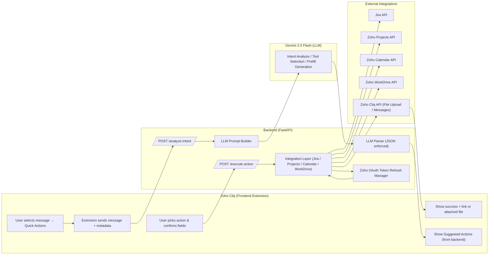

# actionizer-backend
Backend of actionizer extension for zoho cliq

## **Contextual Action Engine for Zoho Cliq**

An AI-powered action engine inside Cliq that converts any chat message into the right workflow — Jira issues, tasks, events, or files — with a single click.

*Smart in-chat automation layer powered by LLM intent analysis*

The extension adds a **one-click productivity layer** inside Zoho Cliq by understanding the meaning of any selected message and instantly offering the most relevant actions.

Instead of copy-pasting text into Jira, Zoho Projects, Calendar, or WorkDrive, the extension automatically analyzes the message, predicts what the user wants, pre-fills the required fields, and executes the action with a single confirmation.

## **What It Does**

### 1. **Understands the user's message**

When a user right-clicks any message in Cliq and selects **Quick Actions**, the extension sends the message and metadata to our backend.
A Gemini LLM interprets intent — for example:

* "We need to deploy by tonight 7 PM" → Schedule a calendar event
* "Create a ticket for this crash log" → Offer a Jira ticket
* "Send me the working.json file" → Fetch & attach file from WorkDrive
* "Assign this as a task" → Create Zoho Projects task

The model returns a ranked list of relevant actions, with suggested field values and human-friendly hints.

---

### 2. **Shows recommended actions in Cliq**

Cliq opens a modal with LLM-generated suggestions:

* **Action name**
* **Description**
* **Prefilled fields / hints**
* **Relevance ranking**

The user picks an action and optionally edits the details.

---

### 3. **Executes integrations seamlessly**

Based on the user’s confirmation, the backend performs the correct API call:

* **Jira**: Create issues with title/description prefilled
* **Zoho Projects**: Add tasks to specific portals/projects
* **Zoho Calendar**: Create events with parsed dates/times
* **Zoho WorkDrive**: Search files, download them, and post them back into Cliq chat

The user receives an in-chat confirmation with links or attached files.

---

# **Why This Matters**

### • Saves time

No switching apps. No repetitive typing. Everything happens within Cliq.

### • Reduces errors

LLM prefilled forms mean fewer mistakes copying details across systems.

### • Supports natural language

Users can work the way they talk — “schedule this”, “file this bug”, “send me that file”.

### • Single-click workflow

Each action takes **2 steps**:

1. Right-click message → Quick Actions
2. Confirm → Action executed

### • Extensible

New tools or workflows can be added by simply updating the tool definitions and prompts.

---

## **Architecture**

### **Frontend (Cliq Extension)**

* Message Action trigger
* Modal UI for showing suggestions + preview fields
* Executes action via backend API
* Displays confirmation and links

### **Backend (FastAPI)**

* `/analyze-intent`: Gemini-powered intent engine
* `/execute-action`: Integration executor
* Modules for Jira, Zoho Projects, Calendar, WorkDrive
* Zoho OAuth token refresh & request signing
* File routing for WorkDrive → Cliq uploads

### **LLM Engine**

* Gemini 2.0 Flash
* Strict JSON schema for tool selection / prefills
* Context-aware reasoning based on message text + metadata + tool capabilities

